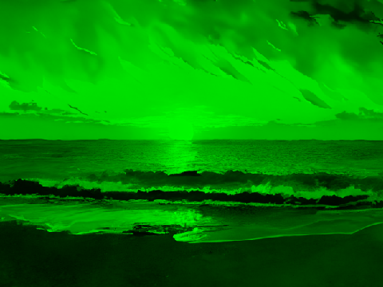

### Mandatory Part

#### Header

The `Header` feature reads a bitmap image file and outputs its properties.

Requirements:

- The program must be able to print header by sub command `header`.
- The output header information of a bmp file must contain at least information about:
  - `file type`
  - `file size in bytes`
  - `header size`
  - `DIB header size`
  - `width in pixels`
  - `height in pixels`
  - `pixel size in bits`
  - `image size in bytes`
- We do not limit the number of headings, you can display more headings at your discretion.
- If any error print an error message with non zero exit status.

Example:


```sh
$ xxd sample.bmp
00000000: 424d 38e9 0700 0000 0000 3600 0000 2800  BM8.......6...(.
00000010: 0000 e001 0000 6801 0000 0100 1800 0000  ......h.........
00000020: 0000 02e9 0700 120b 0000 120b 0000 0000  ................
00000030: 0000 0000 0000 2418 2426 1926 2718 2725  ......$.$&.&'.'%
00000040: 1828 251a 2a29 1e2e 2a1e 2e2a 1f2f 291e  .(%.*)..*..*./).
00000050: 2e2b 1f2e 2b1e 2c28 1b2b 2a1e 2e2a 1f30  .+..+.,(.+*..*.0
00000060: 2f23 3636 2b3f 382d 3f38 2d3f 382e 3f3a  /#66+?8-?8-?8.?:
00000070: 3041 392d 3f36 2a3c 3428 392e 2333 3327  0A9-?6*<4(9.#33'
00000080: 3733 2636 2f23 332f 2534 3127 352f 2433  73&6/#3/%41'5/$3
00000090: 2e21 312f 2133 2f21 3231 2233 3325 3731  .!1/!3/!21"33%71
$
```

```sh
$ ./bitmap header sample.bmp
BMP Header:
- FileType BM
- FileSizeInBytes 518456
- HeaderSize 54
DIB Header:
- DibHeaderSize 40
- WidthInPixels 480
- HeightInPixels 360
- PixelSizeInBits 24
- ImageSizeInBytes 518402
$
```

Error example:

```sh
$ ./bitmap header salem.txt
Error: salem.txt is not bitmap file
$ echo $?
1
```

#### Mirror

The `mirror` feature mirrors a bitmap image either horizontally or vertically.

Requirements:

1. Mirror the image horizontally or vertically. The flag `--mirror` should handle options bellow:

- `horizontal`, `h`, `horizontally`, `hor`
- `vertical`, `v`, `vertically`, `ver`.

2. The `--mirror` option can be combined using multiple times.
3. If any error print an error message with non zero exit status.

> Mirroring a photo vertically is replacing pixels from `top` to `bottom`.

Example:

```sh
$ ls -A
sample.bmp
$ ./bitmap apply --mirror=horizontal sample.bmp sample-mirrored-horizontal.bmp
$ ls -A
result.bmp sample.bmp
$
```

Result:


#### Filter

The program should be able to apply various filters to images using the `--filter` flag.

Requirements:

1. The program must accept filters for images specified by the `--filter` flag. The `--filter` flag should accept a value indicating the type of filter to apply. Multiple filters can be specified by using the `--filter` flag multiple times.

- `--filter=blue`: Apply a filter that retains only the blue channel.
- `--filter=red`: Apply a filter that retains only the red channel.
- `--filter=green`: Apply a filter that retains only the green channel.
- `--filter=grayscale`: Convert the image to grayscale.
- `--filter=negative`: Apply a negative filter.
- `--filter=pixelate`: Apply a pixelation effect. Option pixelates the image with a block size of 20 pixels by default.
- `--filter=blur`: Apply a blur effect.

> You can use any algorithm to realize `grayscale`, `negative`, `pixelate`,`blur` filters.

2. Filters should be applied sequentially in the order they are provided.
3. The `--filter` option can be combined using multiple times.
4. If any error print an error message with non zero exit status.

Examples:

Filter blue:

```sh
$ ./bitmap apply --filter=blue sample.bmp sample-filtered-blue.bmp
```

Result:


Filter red:

```sh
$ ./bitmap apply --filter=red sample.bmp sample-filtered-red.bmp
```

Result:


Filter green:

```sh
$ ./bitmap apply --filter=green sample.bmp sample-filtered-green.bmp
```

Result:



Filter negative:

```sh
$ ./bitmap apply --filter=negative sample.bmp sample-filtered-negative.bmp
```

Result:


Filter pixelate:

```sh
$ ./bitmap apply --filter=pixelate sample.bmp sample-filtered-pixelate.bmp
```

Result:


Filter blur:

```sh
$ ./bitmap apply --filter=blur sample.bmp sample-filtered-blur.bmp
```

Result:


#### Rotate

The `rotate` feature rotates a bitmap image by a specified angle.

Requirements:

1. The program must be able to rotate the image to the any direction using the parameter `--rotate`. The flag `--rotate` should handle options `right` (clockwise), `90`, `180`, `270`, `left`, `-90`, `-180`, `-270`.
2. The `--rotate` option can be used multiple times to achieve the desired rotation. For example, using `--rotate=right` twice will rotate the image by 180 degrees.
3. If any error print an error message with non zero exit status.

Example:

Rotate image to right twice:

```sh
$ ./bitmap apply --rotate=right --rotate=right sample.bmp sample-rotated-right-right.bmp
```

Result:


#### Crop

The `crop` feature trims a bitmap image according to specified parameters.

Requirements:

1. The program crops a bitmap image using the `--crop` flag. The `--crop` option accepts either 2 or 4 values in pixels.
2. The `--crop` option can be combined using multiple times.
3. If any error print an error message with non zero exit status.

How the `--crop` option works:

- The `--crop` option accepts values that specify the offset by X, the offset by Y, the width, and the height. (`--crop=OffsetX-OffsetY-Width-Height`). Where width and height are optional. If the width and height are not provided, then how the values ​​for the width and height will be the remaining distance to the end of the photo.
- The `--crop` option can be used multiple times to achieve the desired size.
- If the total crop values ​​exceed the image size, the program should display an error.

> When the file size is changed, the headers must also be updated.

Examples:

```sh
$ ./bitmap header sample.bmp | grep "Pixels"
- WidthInPixels 480
- HeightInPixels 360
```

Example of cropping a photo:

```sh
$ ./bitmap apply --crop=20-20-100-100 sample.bmp sample-cropped-20-20-80-80.bmp
```

Result:


Example of cropping a photo without width and height:

```sh
$ ./bitmap apply --crop=400-300 sample.bmp sample-cropped-400-300.bmp
```

Result:


Example of cropping a photo with multiple options:

```sh
$ ./bitmap apply --crop=20-20-100-100 --crop=25-25-50-50 sample.bmp sample-cropped-45-45-50-50.bmp
```

Result:


#### Combine apply options

The program can combine all options of `apply` subcommand.

Requirements:

1. The program options must be processed sequentially. This means that if each option of subcommand `apply` were executed one after the other, the result would be the same.
2. If any error print an error message with non zero exit status.

```sh
$ ./bitmap apply --mirror=horizontal --rotate=right --filter=negative --rotate=left --filter=green sample.bmp sample-mh-rr-fn-rl-fg.bmp
```


#### Help

The `help` feature provides information about how to use the program.

Requirements:

1. The program should display a help message when the `-h` or `--help` flag is used.
2. The help feature has maximum priority, which means that when a program operates by combining options with a help flag, program must print help message.
3. The help message should include information about all available flags and their usage.

Example:

```sh
$ ./bitmap
Usage:
  bitmap <command> [arguments]

The commands are:
  header    prints bitmap file header information
  apply     applies processing to the image and saves it to the file
$ ./bitmap header --helps
Usage:
  bitmap header <source_file>

Description:
  Prints bitmap file header information
$ ./bitmap apply --help
Usage:
  bitmap apply [options] <source_file> <output_file>

The options are:
  -h, --help      prints program usage information
  ...
```
